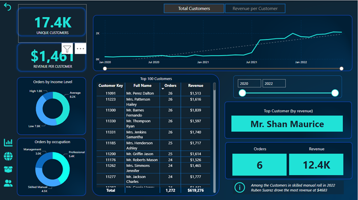
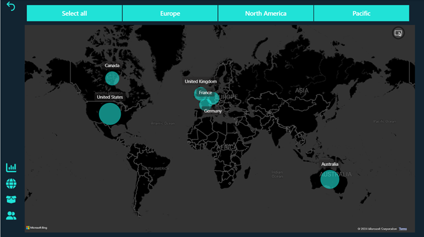

## CycleInsight: Powering Business Intelligence for StarBoard AdventureWorks
-  Exec Dashboard

## Project Overview
The project aims to implement a comprehensive Business Intelligence (BI) solution for Starboard AdventureWorks, a global manufacturing company specializing in cycling equipment and accessories. The primary objective is to enable the management team to track Key Performance Indicators (KPIs), compare regional performance, analyze product-level trends, and identify high-value customers. The solution will leverage Power BI Desktop to connect, transform, and visualize raw data obtained from various sources, including transactions, returns, products, customers, and sales territories. By harnessing the capabilities of Power BI, the project seeks to deliver an intuitive and interactive dashboard that provides actionable insights for informed decision-making.

## Objectives (Business Intelligence Analysis)
  - Track KPIs: Develop a system to monitor and analyze essential performance indicators such as sales, revenue, profit, and returns.

-  Regional Performance Comparison: Enable comparative analysis of performance across different sales territories to identify trends, opportunities, and areas for improvement.

-  Product-Level Trend Analysis: Implement mechanisms to analyze and visualize trends in product performance, including sales volumes, popularity, and profitability.

-  High-Value Customer Identification: Identify and segment high-value customers based on their purchasing behavior, loyalty, and contribution to revenue.

## Tech Stack and Tools Used
  - Power BI Desktop: Utilize Power BI Desktop as the primary tool for data connection, transformation, modeling, and visualization.
  -  DAX (Data Analysis Expressions): Leverage DAX for creating calculated columns, measures, and complex analytical functions within Power BI.

## METHODOLOGY - Extraction, Transformation and Loading (ETL)
  - Extraction: I imported the raw data from the provided CSV files containing information on transactions, returns, products, customers, and sales territories into power query editor in Power BI Desktop. [Click to watch on youtube.]()

  - Transformation: Cleansed, transformed, and reshaped the raw data to prepare it for analysis. Tasks include data normalization, handling missing values, and creating derived metrics. [Click to watch on youtube.]()

  - Loading: Load the transformed data into data model view to build a relational data model. Establish relationships between different tables to facilitate cross-filtering and analysis.
[Click to watch on youtube.]()

- DAX Calculations: Used DAX to create calculated columns and measures necessary for KPI tracking, regional comparison, trend analysis, and customer segmentation. Some of the most vital columns and measures include
  -  Calculated Columns:
       -  Quantity Type = 
          IF(
              'Sales Data'[OrderQuantity] > 1,
              "Multiple Items",
              "Single Item"
          )

       -  Quantity Type = 
          IF(
              'Sales Data'[OrderQuantity] > 1,
              "Multiple Items",
              "Single Item"
          )

  -  Measures:
      -  Total Cost = 
          SUMX(
              'Sales Data',
              'Sales Data'[OrderQuantity] *
              RELATED(
                  'Product Lookup'[ProductCost]
              )
          )

      - Previous Month Profit = 
        CALCULATE(
            [Total Profit],
            DATEADD(
                'Calendar Lookup'[Date],
                -1,
                MONTH
            )
        )
     -   Overall Average Price = 
          CALCULATE(
              [Average Retail Price],
              ALL(
                  'Product Lookup'
              )
          )
    
-  Dashboard Design: Designed an interactive dashboard within Power BI Desktop to visualize the processed data. Implemented intuitive and user-friendly visualizations, such as line charts, bar graphs, and KPI cards, to convey insights effectively to the management team.

## Challenges
Challenges encountered in the project included data quality issues and performance optimization. These challenges were addressed through thorough data cleaning, performance testing and optimization.

## Recommendations
To address challenges faced during the project:
  -  Thorough data cleaning was conducted to address data quality issues and ensure consistency.
  -  Performance testing and optimization techniques were employed to enhance the speed and efficiency of Power BI reports and dashboards.
    
-  Customer Details Dashboard

-  Product Details Dashboard

-  Map Details Dashboard

